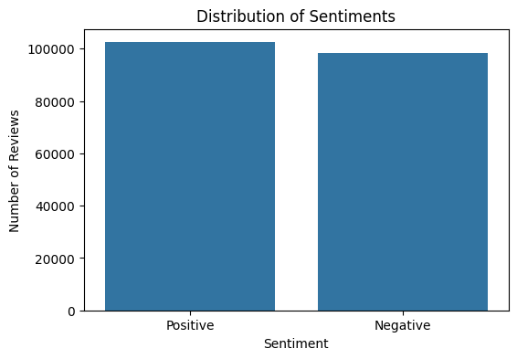
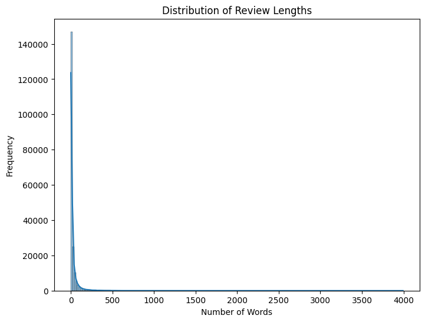
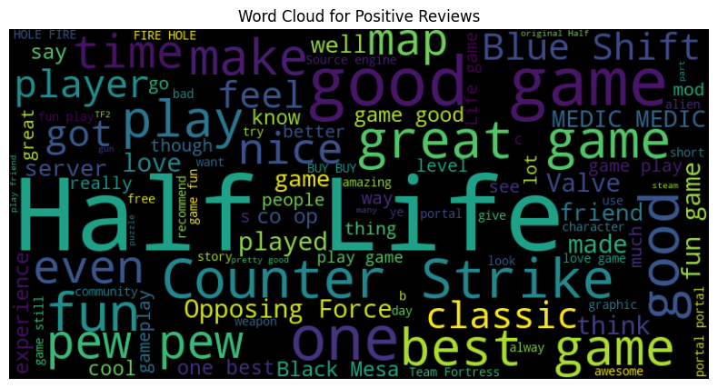
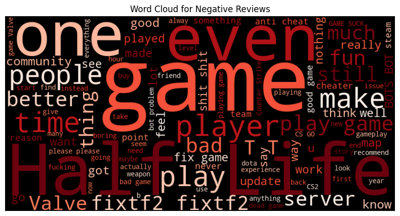
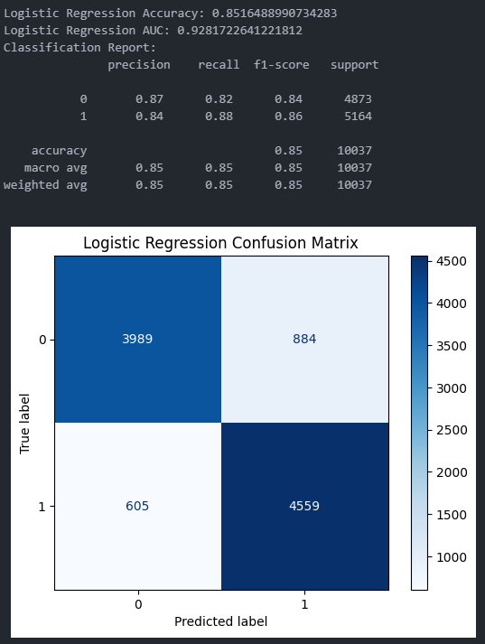
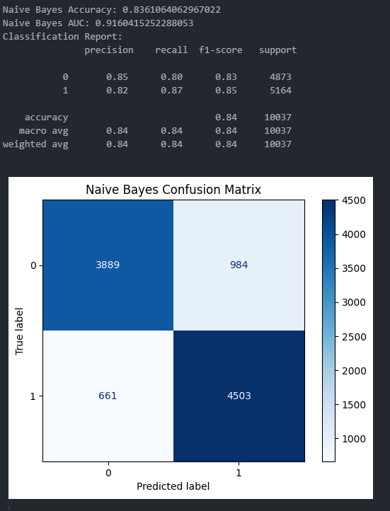
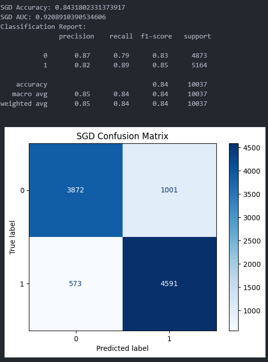
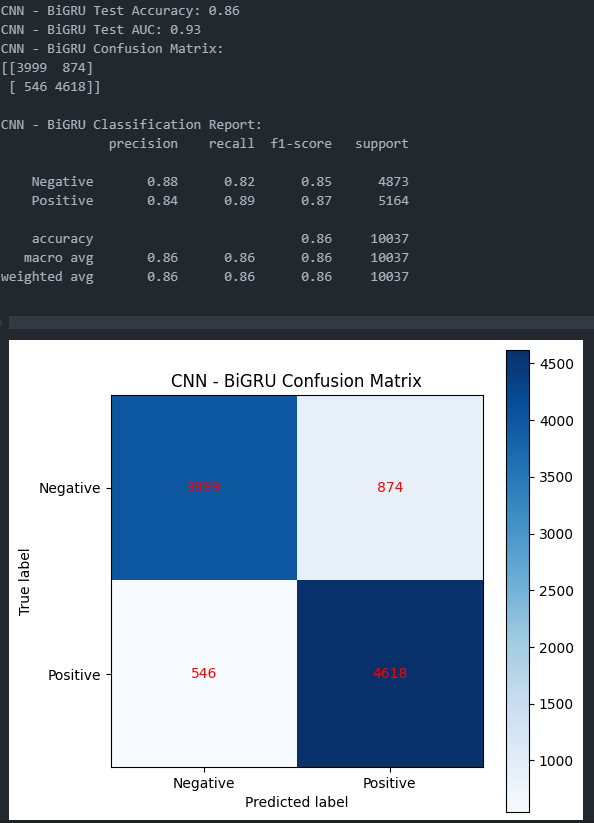
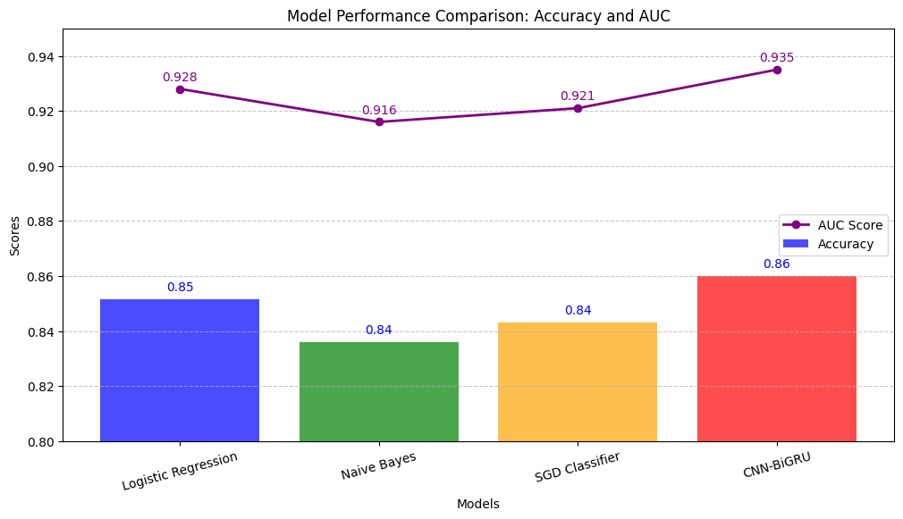
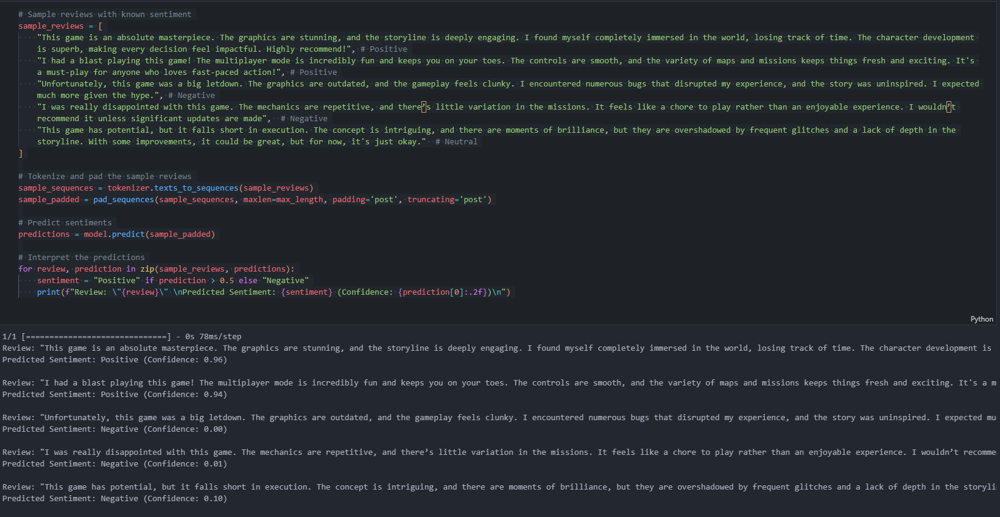

<<<<<<< HEAD
# Project Report: Sentiment Analysis on Steam Reviews ([GitHub](https://github.com/NaufalHD12))

## Introduction

This project focuses on performing sentiment analysis on Steam game reviews to assist users in making informed purchasing decisions. By analyzing the vast number of reviews, we aim to classify them as positive or negative using various machine learning models. This report outlines the methodology, models used, evaluation metrics, and results achieved.

## Project Domain
### Background Problem
Video games have become a major form of entertainment worldwide, with millions of users sharing opinions and reviews online. However, the sheer volume of reviews makes it challenging for potential buyers to gauge the overall sentiment and quality of a game. Users need a way to quickly understand the general sentiment of reviews to make informed purchasing decisions.

### Why and How Should This Problem be Solved?
Analyzing the sentiment of game reviews can help users make better purchasing decisions by summarizing the general opinion of the gaming community. Implementing machine learning models to classify reviews as positive or negative can assist in automating this process. This can be achieved through various models like logistic regression, naive Bayes, SVM, and deep learning approaches such as CNN-BiGRU.

### Research Findings
Studies in sentiment analysis demonstrate that machine learning models, particularly those using deep learning techniques, can effectively classify text sentiment and provide valuable insights across various domains. These models have shown significant success in applications like product reviews, social media analysis, and more. Leveraging these techniques for game reviews can enhance user experience by providing quick and accurate sentiment summaries, which can aid in decision-making and improve overall satisfaction.

**References**:
- https://ieeexplore.ieee.org/document/7820662 
- https://doi.org/10.48550/arXiv.1801.07883

## Business Understanding
### Problem Statements
- How can we efficiently classify game reviews as positive or negative to assist users in decision-making?
- What machine learning models can provide accurate sentiment analysis for game reviews?
### Goals
- Develop machine learning models (logistic regression, naive Bayes, SGD Classifier, and CNN-BiGRU) to classify game reviews.
- Achieve a high accuracy rate with minimum 80% accuracy test to ensure reliable insights for users.

## Data Overview
The dataset used for this analysis is sourced from Kaggle and contains 201,151 reviews. Each entry includes:
- `id`: Unique identifier for each review
- `app_id`: Identifier for the game
- `content`: Text of the review
- `author_id`: Identifier for the review author
- `is_positive`: Label indicating whether the review is positive or negative

- **Link to the dataset**: https://www.kaggle.com/datasets/filipkin/steam-reviews
- **Number of Rows**: 201,151
- **Number of Columns**: 5
- **Missing values** in the `content` column were addressed during preprocessing.

### Exploratory Data Analysis
This section presents a comprehensive Exploratory Data Analysis (EDA) to gain valuable insights into the dataset. The analysis follows these steps:
- Data Loading  
The dataset is loaded into a Pandas DataFrame, ensuring accessibility for analysis.
- Perform initial inspection to obtain general information using **info()** and descriptive statistics using **describe()** on the dataset.
- Data Cleaning: Drop rows with missing content
- Distribution of sentiments  
  
The bar chart illustrates the distribution of sentiments in game reviews, highlighting a nearly balanced dataset with slightly more positive reviews than negative ones. This balance is beneficial for training machine learning models, as it helps avoid bias towards one sentiment class. A balanced dataset ensures that the model can learn and predict both positive and negative sentiments effectively, leading to more accurate sentiment analysis.
- Review length distribution  
  
The histogram of review lengths reveals a highly skewed distribution, where the majority of reviews are relatively short, with a sharp decline in frequency as the word count increases. This indicates that most users prefer concise reviews, with only a few opting for more detailed feedback.
- Word cloud positive review  
  
The word cloud for positive reviews highlights key terms that frequently appear in favorable feedback, such as "Half-Life," "Counter-Strike," "fun," "great," and "best." These prominent words suggest that players often associate positive experiences with specific games and enjoyable gameplay elements. The presence of words like "classic" and "love" indicates a strong nostalgic or emotional connection to these games. This insight can guide developers and marketers in understanding what aspects of a game resonate well with players, potentially informing future game development and promotional strategies to emphasize these positive attributes.
- Word cloud negative review
  
The word cloud for negative reviews reveals common themes of dissatisfaction, with frequent terms like "fix," "bad," "server," and "update" indicating prevalent issues that frustrate players. The prominence of game titles such as "Half-Life" suggests that even popular games are subject to criticism, often related to technical problems or unmet expectations. Words like "people" and "community" imply social aspects or multiplayer experiences that might be problematic. This insight can help developers prioritize addressing technical issues and improving community features to enhance player satisfaction and reduce negative feedback.

## Data Preparation

1. **Cleaning and Tokenization**: 
   - Removed HTML tags and extra whitespace.
   - Removed stopwords using NLTK.
   - Tokenized the text and applied padding to ensure uniform input lengths for neural networks.

2. **Label Encoding**: 
   - Converted sentiment labels to binary format (1 for positive, 0 for negative).

3. **Splitting the Data**: 
   - 90% for training, 10% for temporary validation and testing.
   - Further split the temporary set into 5% validation and 5% testing.

### Feature Engineering

- **TF-IDF Vectorization**: Transformed text data into numerical format for traditional machine learning models.
- **Neural Network Preparation**: Used tokenization and padding to prepare data for models like CNN-BiGRU.

## Models and Evaluation

### Models Implemented

1. **Logistic Regression**: Achieved an accuracy of 85.16% and AUC of 0.928.
2. **Naive Bayes**: Achieved an accuracy of 83.61% and AUC of 0.916.
3. **SGD Classifier**: Achieved an accuracy of 84.32% and AUC of 0.921.
4. **CNN-BiGRU**: Achieved the highest accuracy of 86% and AUC of 0.935.

### Evaluation Metrics
Metrics that are used include:  
**Accuracy, the Confusion Matrix, and the Area Under the ROC Curve (AUC)**. By using those metrics together provides a comprehensive evaluation of a classification model's performance. Each metric offers unique insights that complement the others, enabling a well-rounded assessment. Accuracy serves as a quick and intuitive baseline measure, giving an overall sense of how often the model makes correct predictions. However, it has limitations in scenarios involving class imbalance, where additional metrics are needed to understand performance nuances.

The Confusion Matrix addresses this by breaking down predictions into true positives, true negatives, false positives, and false negatives. This allows for the computation of metrics like precision, recall, and F1-score, which are critical in understanding class-specific performance. It highlights issues such as misclassifying minority classes, which might go unnoticed with accuracy alone. For tasks where false positives and false negatives have different costs, the Confusion Matrix is invaluable in diagnosing and addressing specific weaknesses.

AUC further enhances the evaluation by measuring the model’s ability to distinguish between classes across all possible classification thresholds. It is particularly beneficial for imbalanced datasets, as it focuses on ranking rather than absolute predictions. AUC provides insights into the trade-off between sensitivity and specificity, helping to determine an optimal threshold for the task. Together, these three metrics ensure a robust and well-rounded analysis, making them essential for evaluating classification models effectively.
#### Logistics Regression Evaluation
  
The logistic regression model achieved an accuracy of 85.16%, indicating that it correctly classified 85.16% of the reviews. The classification report provides more detailed insights into the model's performance. For class 0 (negative reviews), the precision is 0.87, meaning that 87% of the reviews predicted as negative were actually negative. The recall for this class is 0.82, indicating that 82% of all actual negative reviews were correctly identified. For class 1 (positive reviews), the precision is 0.84, and the recall is 0.88, showing that the model is slightly better at identifying positive reviews. The F1-scores, which balance precision and recall, are 0.84 for class 0 and 0.86 for class 1. The confusion matrix further illustrates the model's performance, with 3989 true negatives, 4559 true positives, 884 false positives, and 605 false negatives. Overall, the model performs well, with a balanced ability to classify both positive and negative sentiments.
#### Naive Bayes Evaluation
  
The Naive Bayes model achieved an accuracy of 83.61%, indicating it correctly classified 83.61% of the reviews. In the classification report, for class 0 (negative reviews), the precision is 0.85, meaning 85% of the predicted negative reviews were correct, while the recall is 0.80, showing that 80% of actual negative reviews were identified. For class 1 (positive reviews), the precision is 0.82, and the recall is 0.87, indicating the model is slightly better at identifying positive reviews. The F1-scores are 0.83 for class 0 and 0.85 for class 1, balancing precision and recall. The confusion matrix shows 3889 true negatives, 4503 true positives, 984 false positives, and 661 false negatives. Overall, the model performs well but slightly less accurately than logistic regression, with a tendency to misclassify some negative reviews as positive.
#### SGD Evaluation
  
The SGDClassifier achieved an accuracy of 84.32%, meaning it correctly classified 84.32% of the reviews. In the classification report, for class 0 (negative reviews), the precision is 0.87, indicating that 87% of the predicted negative reviews were correct, while the recall is 0.79, showing that 79% of actual negative reviews were identified. For class 1 (positive reviews), the precision is 0.82, and the recall is 0.89, indicating the model is better at identifying positive reviews. The F1-scores are 0.83 for class 0 and 0.85 for class 1, balancing precision and recall. The confusion matrix shows 3872 true negatives, 4591 true positives, 1001 false positives, and 573 false negatives. Overall, the model performs well, with a slight tendency to misclassify some negative reviews as positive, similar to the Naive Bayes model but with slightly better recall for positive reviews.
#### CNN-BiGRU Evaluation
  
The CNN-BiGRU model achieved a test accuracy of 86% and a high AUC of 0.94, indicating excellent performance in distinguishing between positive and negative reviews. The classification report shows a precision of 0.88 for negative reviews and 0.84 for positive reviews, meaning the model is slightly better at predicting negatives accurately. The recall is 0.82 for negatives and 0.89 for positives, indicating a strong ability to identify positive reviews. F1-scores are 0.85 for negatives and 0.87 for positives, reflecting a good balance between precision and recall. The confusion matrix reveals 3999 true negatives, 4618 true positives, 874 false positives, and 546 false negatives. Overall, the model effectively captures the sentiment in reviews, with a slight tendency to misclassify some negative reviews as positive, but it performs well in capturing the positive class.

## Results
  
The CNN-BiGRU model outperformed the other models, demonstrating a strong ability to capture complex patterns in the text data. It effectively classified both positive and negative sentiments, with a slight tendency to misclassify some negative reviews as positive.
### Testing on new reviews
  
The model successfully predicted Positive sentiments for favorable reviews (with high confidence of 0.94 and 0.96) and Negative sentiments for critical reviews (with very low confidence, close to 0). However, the review classified as "Neutral" was also predicted as Negative, showing that the model's binary classification approach doesn't handle neutral or ambiguous sentiment well. Given that the dataset only includes two classes (positive and negative), the model's clear predictions for these categories further support its effectiveness in the binary sentiment analysis task, though it might need additional fine-tuning or more nuanced labels for neutral sentiments in the future.

## Conclusion

The CNN-BiGRU model is selected as the optimal approach for sentiment analysis of game reviews due to its superior performance in both accuracy and AUC. This model can enhance user experience by providing reliable sentiment summaries, assisting potential buyers in making informed decisions.

## Future Work

Future improvements could include:
- Further optimization of the CNN-BiGRU model.
- Integration of additional features such as metadata or user profiles.
- Deployment into a real-time application for broader accessibility.

This project sets a solid foundation for ongoing advancements in sentiment analysis within the gaming industry.
=======
# Steam-Sentiment-Analysis
 
# Steam Game Reviews Sentiment Analysis

## Project Overview
This project performs sentiment analysis on a 10% sample of Steam game reviews using machine learning techniques. The goal is to understand user sentiments towards different games and develop a model that can automatically classify reviews as positive or negative.

## Dataset
- **Total Reviews**: 622,599 (10% sample)
- **Sentiment Distribution**:
  - Positive Reviews (Recommended): 513,031 (82.40%)
  - Negative Reviews (Not Recommended): 109,568 (17.60%)
- Link: https://www.kaggle.com/datasets/andrewmvd/steam-reviews/data

## Methodology

### Data Preprocessing
- Cleaned and processed review text data
- Handled missing values
- Retained 97.02% of the original sample

### Feature Extraction
- Used TF-IDF Vectorization
- Maximum of 5,000 features selected

### Machine Learning Model
- Algorithm: Multinomial Naive Bayes Classifier
- Model Performance:
  - Accuracy: 0.85
  - F1-Score: 0.92

## Key Insights

### Top Games by Positive Sentiment
1. Terraria (8,205 positive reviews)
2. Dota 2 (6,227 positive reviews)
3. Rust (6,150 positive reviews)
4. PAYDAY 2 (6,110 positive reviews)
5. DayZ (5,801 positive reviews)

### Top Games by Negative Sentiment
1. DayZ (3,007 negative reviews)
2. PAYDAY 2 (2,743 negative reviews)
3. Rust (1,573 negative reviews)
4. Robocraft (1,278 negative reviews)
5. Heroes & Generals (1,194 negative reviews)

### Most Informative Features for Positive Sentiment
- Words like 'underrated', 'fun', and 'awesome' strongly indicate positive reviews

## Limitations
- Analysis based on a 10% sample of the dataset
- Results may vary with different sampling
- Model performance might differ on the full dataset

## Tools and Libraries
- Python
- Pandas
- Scikit-learn
- Matplotlib
- Seaborn
- TensorFlow/Keras (optional for future work)

## How to Reproduce
1. Clone the repository
2. Install required dependencies
3. Run preprocessing scripts
4. Execute sentiment analysis notebook
5. Generate visualizations and analysis

**Note**: This analysis provides insights into Steam game reviews and demonstrates the potential of automated sentiment classification in understanding user experiences.
>>>>>>> b35f77ef0a2b8eb9336d86a19295ade40e5fd47b
